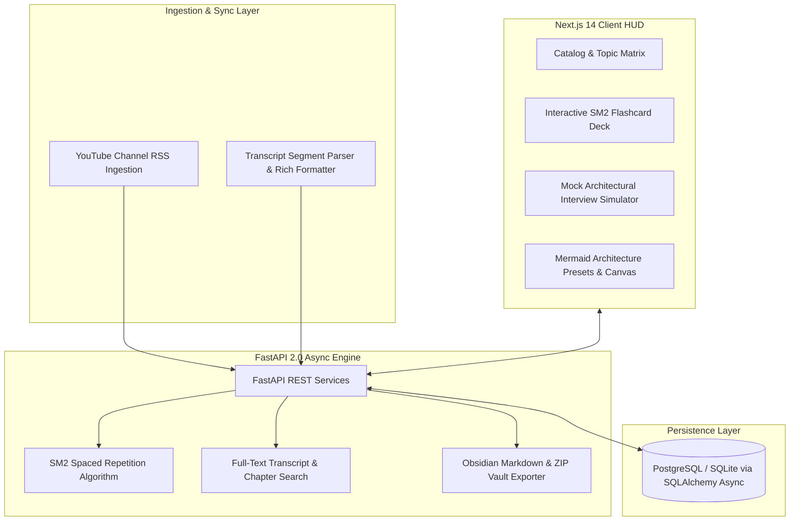

# 🏛️ System Design Master Vault

**An interactive, full-stack knowledge base, spaced-repetition trainer, and interview preparation platform for distributed systems architects.**

[](LICENSE)
[](https://fastapi.tiangolo.com/)
[](https://nextjs.org/)
[](https://www.postgresql.org/)
[](https://www.typescriptlang.org/)

---

## 🌟 Overview

**System Design Master Vault** is an all-in-one distributed systems curriculum and interview prep engine. It brings together curated video breakdowns from top engineering channels, time-synchronized transcripts, interactive architecture presets, flashcards with SM2 spaced repetition, and an automated Obsidian vault markdown exporter.



---

## ✨ Features

- 📚 **System Design Topic Catalog**: Curated deep dives across Rate Limiters, Distributed Caching, Message Queues, Consensus (Raft/Paxos), Consistent Hashing, Sharding, and API Gateways.
- 🧠 **SM2 Spaced Repetition Engine**: Calculates optimal review intervals, easiness factor ($EF$), and repetition intervals based on user confidence ratings (0–5).
- 🔍 **Time-Synchronized Transcript Search**: Full-text keyword and semantic search across video chapters, timestamps, and transcripts.
- 📦 **Obsidian Vault Exporter**: 1-click generation of fully formatted, cross-linked Obsidian markdown vaults with YAML frontmatter, tags, and Mermaid diagrams.
- 🎙️ **Mock Architectural Interview Simulator**: Real-time evaluation prompts and scoring rubrics for FAANG-level system design rounds.
- 🎨 **Interactive Diagram Presets**: Ready-to-use Mermaid and Cytoscape architecture patterns for distributed workflows.

---

## 🏗️ Architecture & Tech Stack

- **Backend:** Python 3.12+, FastAPI, SQLAlchemy Async, Pydantic v2, aiosqlite / asyncpg, Uvicorn
- **Frontend:** Next.js 14 (App Router), React 18, TypeScript, Tailwind CSS, Lucide React, Mermaid.js
- **Persistence:** SQLite for zero-config local development; PostgreSQL support for cloud production.

---

## 🚀 Quick Start

### 1. Backend Setup
```bash
cd backend
python -m venv .venv
source .venv/bin/activate  # On Windows: .venv\Scripts\activate
pip install -r requirements.txt
uvicorn main:app --reload --port 8000
```
API Documentation will be live at `http://127.0.0.1:8000/docs`.

### 2. Frontend Setup
```bash
cd frontend
npm install
npm run dev
```
The application dashboard will be live at `http://localhost:3000`.

---

## 📜 License

MIT License. See [LICENSE](LICENSE) for details.
